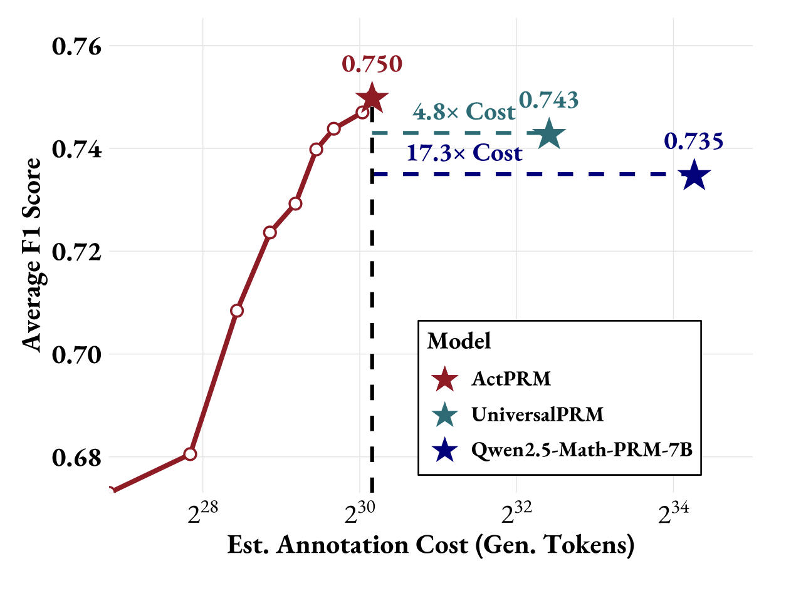

<div align="center">

# Efficient Process Reward Model Training via Active Learning

The official Implementation for Paper "Efficient Process Reward Model Training via Active Learning".

<!-- [](https://arxiv.org/pdf/2503.20783) -->

[](https://huggingface.co/collections/sail/oat-zero-understanding-r1-zero-like-training-67dcdb07b9f3eb05f1501c4a) [](https://huggingface.co/collections/sail/oat-zero-understanding-r1-zero-like-training-67dcdb07b9f3eb05f1501c4a)

</div>

## 🔥 Updates

- 14/04/2025: We release our code, models and data. Paper will be available soon.

## 🏴󠁶󠁵󠁭󠁡󠁰󠁿 Overview

**TL;DR: We achieved SOTA performance on [ProcessBench](https://github.com/QwenLM/ProcessBench) (75.0%) and [PRMBench](https://github.com/ssmisya/PRMBench?tab=readme-ov-file) (65.5%) with merely 5% labeling cost compared with `Qwen/Qwen2.5-Math-PRM-7B`**.

 <p align="center">
  
</p>

## ⚡️ Quickstart

### Installation
```shell
git clone https://github.com/sail-sg/ActivePRM.git
cd ActivePRM
pip install -e . # tested in conda env where python==3.11
```

### Replication

- Evaluate our `sail/ActPRM-X` and `sail/ActPRM` on ProcessBench simply by running
```shell
cd examples
python py_scripts/test_actprm_on_processbench.py
```

- Training PRM with Active Learning
```shell
cd examples
bash scripts/pool_based_active_learning.sh sail/ActPRMData
```

