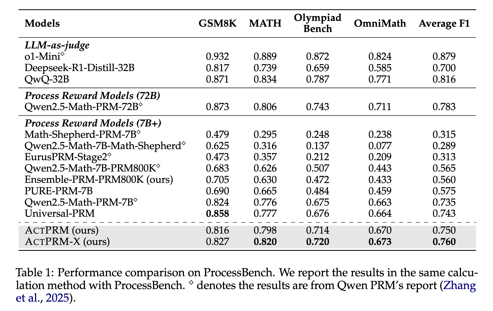
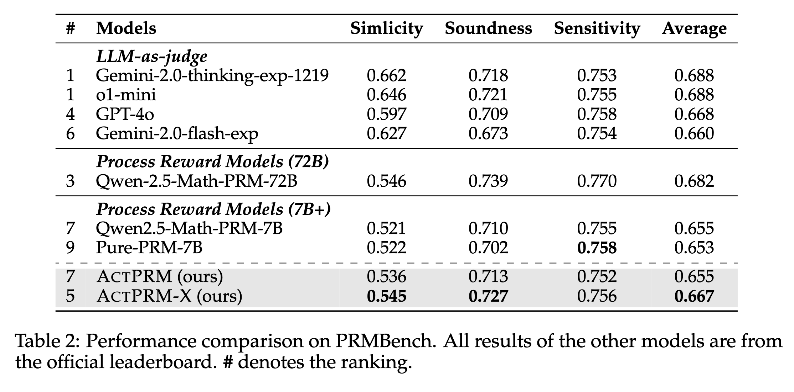

<div align="center">

# Efficient Process Reward Model Training via Active Learning

The official Implementation for Paper "Efficient Process Reward Model Training via Active Learning".

[](http://arxiv.org/abs/2504.10559) [](https://huggingface.co/collections/sail/active-prm-67fccbc10c94c41a6d6b26d9)

</div>

## 🔥 Updates

- 16/04/2025: Our paper is available on [arxiv](http://arxiv.org/abs/2504.10559) now!
- 14/04/2025: We release our code, models and data. Paper will be available soon.
- 14/04/2025: Within 7B PRMs, our model `sail/ActPRM-X` (based on `Qwen/Qwen2.5-Math-PRM-7B`) achieved new SOTA performance on ProcessBench (76.0%) and PRMBench (66.7%).

## 🏴󠁶󠁵󠁭󠁡󠁰󠁿 Overview

**TL;DR: We achieved SOTA performance on [ProcessBench](https://github.com/QwenLM/ProcessBench) (75.0%) and [PRMBench](https://github.com/ssmisya/PRMBench?tab=readme-ov-file) (65.5%) with merely 5% labeling cost compared with `Qwen/Qwen2.5-Math-PRM-7B`**.

 <p align="center">
  
</p>

## 📊 Results

<details>
<summary>ProcessBench</summary>

</details>
<details>
<summary>PRMBench</summary>

</details>

## ⚡️ Quickstart

### Installation
```shell
git clone https://github.com/sail-sg/ActivePRM.git
cd ActivePRM
pip install -e . # tested in conda env where python==3.11
```

### Replication

- Evaluate our `sail/ActPRM-X` and `sail/ActPRM` on ProcessBench simply by running
```shell
cd examples
python py_scripts/test_actprm_on_processbench.py
```

- Training PRM with Active Learning
```shell
cd examples
bash scripts/pool_based_active_learning.sh sail/ActPRMData
```

## Citation
If you find our repo or paper helpful, please cite
```
@misc{duan2025actprm,
      title={Efficient Process Reward Model Training via Active Learning}, 
      author={Keyu Duan and Zichen Liu and Xin Mao and Tianyu Pang and Changyu Chen and Qiguang Chen and Michael Qizhe Shieh and Longxu Dou},
      year={2025},
      eprint={2504.10559},
      archivePrefix={arXiv},
      primaryClass={cs.LG},
      url={https://arxiv.org/abs/2504.10559}, 
}
```